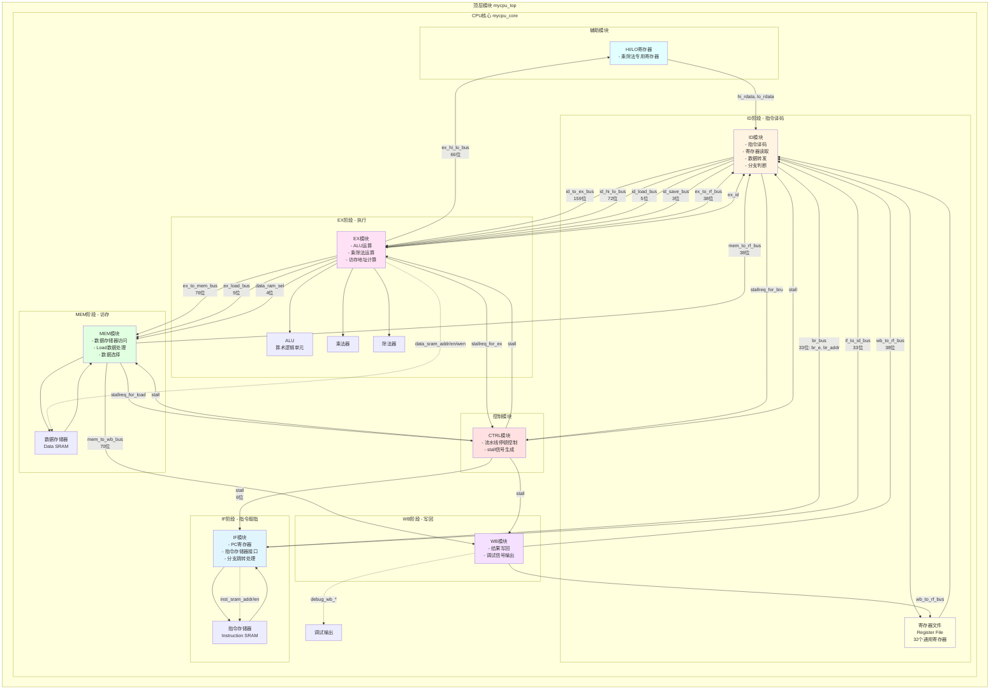
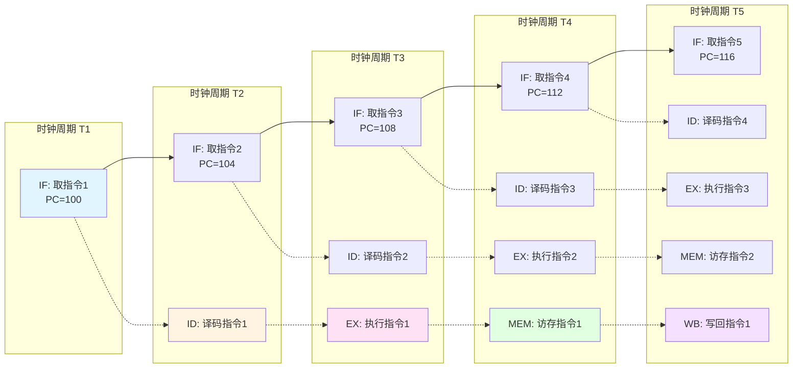
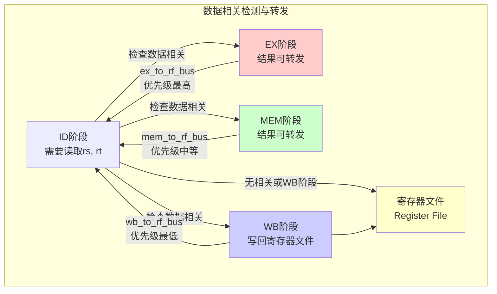
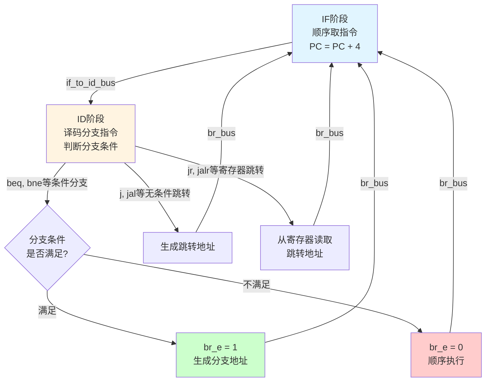
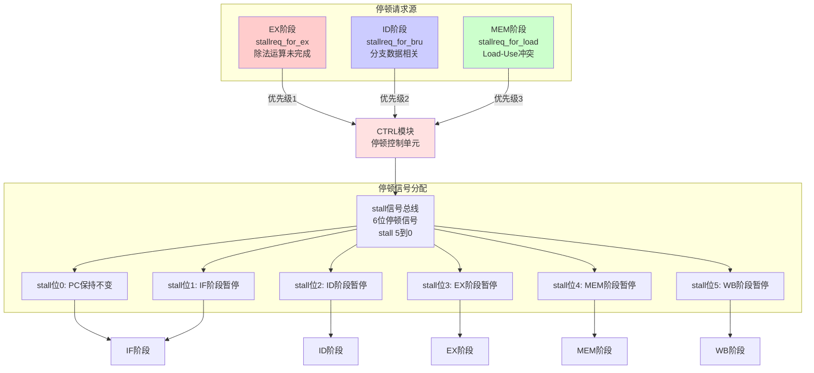
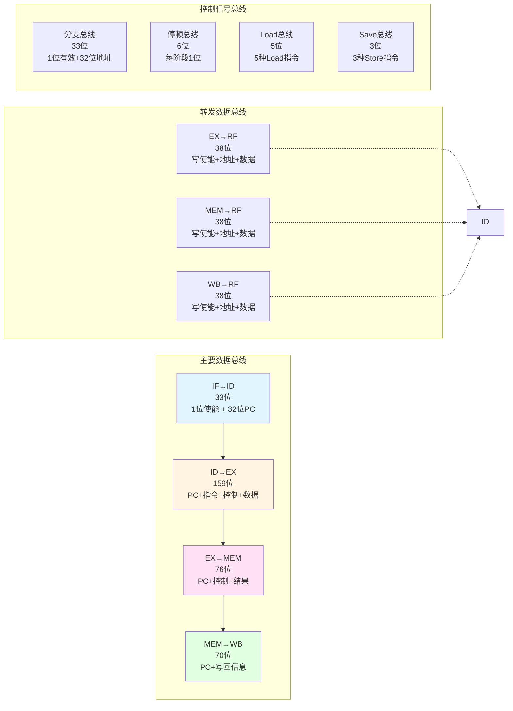
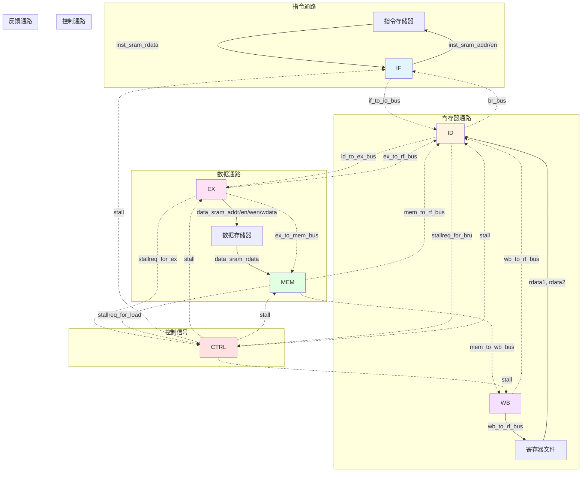

# MIPS CPU 五级流水线架构流程图

## 完整CPU架构图

```mermaid
graph TB
    subgraph "顶层模块 mycpu_top"
        subgraph "CPU核心 mycpu_core"
            
            subgraph "IF阶段 - 指令取指"
                IF[IF模块<br/>- PC寄存器<br/>- 指令存储器接口<br/>- 分支跳转处理]
                InstSRAM[指令存储器<br/>Instruction SRAM]
                IF --> InstSRAM
                InstSRAM --> IF
            end
            
            subgraph "ID阶段 - 指令译码"
                ID[ID模块<br/>- 指令译码<br/>- 寄存器读取<br/>- 数据转发<br/>- 分支判断]
                RegFile[寄存器文件<br/>Register File<br/>32个通用寄存器]
                ID --> RegFile
                RegFile --> ID
            end
            
            subgraph "EX阶段 - 执行"
                EX[EX模块<br/>- ALU运算<br/>- 乘除法运算<br/>- 访存地址计算]
                ALU[ALU<br/>算术逻辑单元]
                MUL[乘法器]
                DIV[除法器]
                EX --> ALU
                EX --> MUL
                EX --> DIV
            end
            
            subgraph "MEM阶段 - 访存"
                MEM[MEM模块<br/>- 数据存储器访问<br/>- Load数据处理<br/>- 数据选择]
                DataSRAM[数据存储器<br/>Data SRAM]
                MEM --> DataSRAM
                DataSRAM --> MEM
            end
            
            subgraph "WB阶段 - 写回"
                WB[WB模块<br/>- 结果写回<br/>- 调试信号输出]
            end
            
            subgraph "控制模块"
                CTRL[CTRL模块<br/>- 流水线停顿控制<br/>- stall信号生成]
            end
            
            subgraph "辅助模块"
                HILO[HI/LO寄存器<br/>- 乘除法专用寄存器]
            end
            
            %% 主要数据流
            IF -->|if_to_id_bus<br/>33位| ID
            ID -->|id_to_ex_bus<br/>159位| EX
            EX -->|ex_to_mem_bus<br/>76位| MEM
            MEM -->|mem_to_wb_bus<br/>70位| WB
            
            %% 分支控制
            ID -->|br_bus<br/>33位: br_e, br_addr| IF
            
            %% 数据转发路径
            EX -->|ex_to_rf_bus<br/>38位| ID
            MEM -->|mem_to_rf_bus<br/>38位| ID
            WB -->|wb_to_rf_bus<br/>38位| ID
            WB -->|wb_to_rf_bus| RegFile
            
            %% HI/LO寄存器路径
            ID -->|id_hi_lo_bus<br/>72位| EX
            EX -->|ex_hi_lo_bus<br/>66位| HILO
            HILO -->|hi_rdata, lo_rdata| ID
            
            %% Load/Save信号
            ID -->|id_load_bus<br/>5位| EX
            ID -->|id_save_bus<br/>3位| EX
            EX -->|ex_load_bus<br/>5位| MEM
            
            %% 停顿控制
            EX -->|stallreq_for_ex| CTRL
            ID -->|stallreq_for_bru| CTRL
            MEM -->|stallreq_for_load| CTRL
            CTRL -->|stall<br/>6位| IF
            CTRL -->|stall| ID
            CTRL -->|stall| EX
            CTRL -->|stall| MEM
            CTRL -->|stall| WB
            
            %% 其他信号
            EX -->|ex_id| ID
            EX -->|data_ram_sel<br/>4位| MEM
            
            %% 外部接口
            IF -.->|inst_sram_addr/en| InstSRAM
            EX -.->|data_sram_addr/en/wen| DataSRAM
            WB -.->|debug_wb_*| DebugOut[调试输出]
        end
    end
    
    style IF fill:#e1f5ff
    style ID fill:#fff4e1
    style EX fill:#ffe1f5
    style MEM fill:#e1ffe1
    style WB fill:#f5e1ff
    style CTRL fill:#ffe1e1
    style RegFile fill:#ffffe1
    style HILO fill:#e1ffff
```

## 流水线数据流详细图

```mermaid
graph LR
    subgraph "时钟周期 T1"
        IF1[IF: 取指令1<br/>PC=100]
    end
    
    subgraph "时钟周期 T2"
        IF2[IF: 取指令2<br/>PC=104]
        ID1[ID: 译码指令1]
    end
    
    subgraph "时钟周期 T3"
        IF3[IF: 取指令3<br/>PC=108]
        ID2[ID: 译码指令2]
        EX1[EX: 执行指令1]
    end
    
    subgraph "时钟周期 T4"
        IF4[IF: 取指令4<br/>PC=112]
        ID3[ID: 译码指令3]
        EX2[EX: 执行指令2]
        MEM1[MEM: 访存指令1]
    end
    
    subgraph "时钟周期 T5"
        IF5[IF: 取指令5<br/>PC=116]
        ID4[ID: 译码指令4]
        EX3[EX: 执行指令3]
        MEM2[MEM: 访存指令2]
        WB1[WB: 写回指令1]
    end
    
    IF1 --> IF2
    IF2 --> IF3
    IF3 --> IF4
    IF4 --> IF5
    
    IF1 -.-> ID1
    IF2 -.-> ID2
    IF3 -.-> ID3
    IF4 -.-> ID4
    
    ID1 -.-> EX1
    ID2 -.-> EX2
    ID3 -.-> EX3
    
    EX1 -.-> MEM1
    EX2 -.-> MEM2
    
    MEM1 -.-> WB1
    
    style IF1 fill:#e1f5ff
    style ID1 fill:#fff4e1
    style EX1 fill:#ffe1f5
    style MEM1 fill:#e1ffe1
    style WB1 fill:#f5e1ff
```

## 数据转发路径图

```mermaid
graph TB
    subgraph "数据相关检测与转发"
        ID[ID阶段<br/>需要读取rs, rt]
        EX[EX阶段<br/>结果可转发]
        MEM[MEM阶段<br/>结果可转发]
        WB[WB阶段<br/>写回寄存器文件]
        RF[寄存器文件<br/>Register File]
        
        ID -->|检查数据相关| EX
        ID -->|检查数据相关| MEM
        ID -->|检查数据相关| WB
        ID -->|无相关或WB阶段| RF
        
        EX -->|ex_to_rf_bus<br/>优先级最高| ID
        MEM -->|mem_to_rf_bus<br/>优先级中等| ID
        WB -->|wb_to_rf_bus<br/>优先级最低| ID
        WB --> RF
        
        style EX fill:#ffcccc
        style MEM fill:#ccffcc
        style WB fill:#ccccff
        style RF fill:#ffffcc
    end
```

## 分支控制流程图

```mermaid
graph TD
    IF[IF阶段<br/>顺序取指令<br/>PC = PC + 4]
    ID[ID阶段<br/>译码分支指令<br/>判断分支条件]
    
    ID -->|beq, bne等条件分支| BranchCheck{分支条件<br/>是否满足?}
    ID -->|j, jal等无条件跳转| Jump[生成跳转地址]
    ID -->|jr, jalr等寄存器跳转| RegJump[从寄存器读取<br/>跳转地址]
    
    BranchCheck -->|满足| BranchYes[br_e = 1<br/>生成分支地址]
    BranchCheck -->|不满足| BranchNo[br_e = 0<br/>顺序执行]
    
    BranchYes -->|br_bus| IF
    BranchNo -->|br_bus| IF
    Jump -->|br_bus| IF
    RegJump -->|br_bus| IF
    
    IF -->|if_to_id_bus| ID
    
    style IF fill:#e1f5ff
    style ID fill:#fff4e1
    style BranchYes fill:#ccffcc
    style BranchNo fill:#ffcccc
```

## 停顿控制流程图

```mermaid
graph TD
    subgraph "停顿请求源"
        EX_Stall[EX阶段<br/>stallreq_for_ex<br/>除法运算未完成]
        BRU_Stall[ID阶段<br/>stallreq_for_bru<br/>分支数据相关]
        LOAD_Stall[MEM阶段<br/>stallreq_for_load<br/>Load-Use冲突]
    end
    
    CTRL[CTRL模块<br/>停顿控制单元]
    
    subgraph "停顿信号分配"
        StallSignal["stall信号总线<br/>6位停顿信号<br/>stall 5到0"]
        StallSignal --> Stall0["stall位0: PC保持不变"]
        StallSignal --> Stall1["stall位1: IF阶段暂停"]
        StallSignal --> Stall2["stall位2: ID阶段暂停"]
        StallSignal --> Stall3["stall位3: EX阶段暂停"]
        StallSignal --> Stall4["stall位4: MEM阶段暂停"]
        StallSignal --> Stall5["stall位5: WB阶段暂停"]
    end
    
    EX_Stall -->|优先级1| CTRL
    BRU_Stall -->|优先级2| CTRL
    LOAD_Stall -->|优先级3| CTRL
    
    CTRL --> StallSignal
    
    Stall0 --> IF_Stage[IF阶段]
    Stall1 --> IF_Stage
    Stall2 --> ID_Stage[ID阶段]
    Stall3 --> EX_Stage[EX阶段]
    Stall4 --> MEM_Stage[MEM阶段]
    Stall5 --> WB_Stage[WB阶段]
    
    style CTRL fill:#ffe1e1
    style EX_Stall fill:#ffcccc
    style BRU_Stall fill:#ccccff
    style LOAD_Stall fill:#ccffcc
```

## 信号总线位宽说明

```mermaid
graph LR
    subgraph "主要数据总线"
        IF_ID[IF→ID<br/>33位<br/>1位使能 + 32位PC]
        ID_EX[ID→EX<br/>159位<br/>PC+指令+控制+数据]
        EX_MEM[EX→MEM<br/>76位<br/>PC+控制+结果]
        MEM_WB[MEM→WB<br/>70位<br/>PC+写回信息]
    end
    
    subgraph "转发数据总线"
        EX_RF[EX→RF<br/>38位<br/>写使能+地址+数据]
        MEM_RF[MEM→RF<br/>38位<br/>写使能+地址+数据]
        WB_RF[WB→RF<br/>38位<br/>写使能+地址+数据]
    end
    
    subgraph "控制信号总线"
        BR_BUS[分支总线<br/>33位<br/>1位有效+32位地址]
        STALL[停顿总线<br/>6位<br/>每阶段1位]
        LOAD[Load总线<br/>5位<br/>5种Load指令]
        SAVE[Save总线<br/>3位<br/>3种Store指令]
    end
    
    IF_ID --> ID_EX
    ID_EX --> EX_MEM
    EX_MEM --> MEM_WB
    
    EX_RF -.-> ID
    MEM_RF -.-> ID
    WB_RF -.-> ID
    
    style IF_ID fill:#e1f5ff
    style ID_EX fill:#fff4e1
    style EX_MEM fill:#ffe1f5
    style MEM_WB fill:#e1ffe1
```

## 完整模块连接关系图

```mermaid
graph TB
    subgraph "指令通路"
        I1[指令存储器] -->|inst_sram_rdata| IF
        IF -->|inst_sram_addr/en| I1
    end
    
    subgraph "数据通路"
        D1[数据存储器] -->|data_sram_rdata| MEM
        EX -->|data_sram_addr/en/wen/wdata| D1
    end
    
    subgraph "寄存器通路"
        RF[寄存器文件] -->|rdata1, rdata2| ID
        WB -->|wb_to_rf_bus| RF
    end
    
    subgraph "控制通路"
        IF -.->|if_to_id_bus| ID
        ID -.->|id_to_ex_bus| EX
        EX -.->|ex_to_mem_bus| MEM
        MEM -.->|mem_to_wb_bus| WB
    end
    
    subgraph "反馈通路"
        ID -.->|br_bus| IF
        EX -.->|ex_to_rf_bus| ID
        MEM -.->|mem_to_rf_bus| ID
        WB -.->|wb_to_rf_bus| ID
    end
    
    subgraph "控制信号"
        CTRL -.->|stall| IF
        CTRL -.->|stall| ID
        CTRL -.->|stall| EX
        CTRL -.->|stall| MEM
        CTRL -.->|stall| WB
        EX -.->|stallreq_for_ex| CTRL
        ID -.->|stallreq_for_bru| CTRL
        MEM -.->|stallreq_for_load| CTRL
    end
    
    style IF fill:#e1f5ff
    style ID fill:#fff4e1
    style EX fill:#ffe1f5
    style MEM fill:#e1ffe1
    style WB fill:#f5e1ff
    style CTRL fill:#ffe1e1
```

